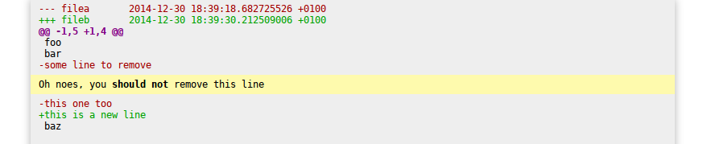

=============
diff-annotate
=============

Generates a HTML file from a diff file and some annotations.

Example
=======

We'll take too files as an example: `filea` and `fileb`.

.. code:: bash

    $ diff -u filea fileb
    --- filea       2014-12-30 18:39:18.682725526 +0100
    +++ fileb       2014-12-30 18:39:30.212509006 +0100
    @@ -1,5 +1,4 @@
     foo
     bar
    -some line to remove
    -this one too
    +this is a new line
     baz

You can start editing annotations with something like that (with a bash
compatible shell):

.. code:: bash

    $ diff-annotate <(diff -u filea fileb) review.html

A wild editor appears! Add something like :code:`> Oh noes, you **should not**
remove this line` below the line :code:`-some line to remove`.

Once saved, you can then see the result in your favorite browser:

.. code:: bash

    $ firefox review.html

You can edit annotations by reexecuting the same command (annotations are
stored in the output file)

.. code:: bash

    $ diff-annotate <(diff -u filea fileb) review.html

Of course, this is not limited to the 'diff' command. diff-annotate should
handle any unified diff you give as first argument. For example, you can pass
a plain diff file:

.. code:: bash

    $ diff-annotate my_diff.diff review.html

Or a :code:`git diff` command:

.. code:: bash

    $ diff-annotate <(git diff -w HEAD^) review.html

Or even a git commit with a message:

.. code:: bash

    $ diff-annotate <(git show HEAD) review.html

Annotations syntax
==================

All annotation lines should start with a 'greater than' character.

Comments are formated with `reStructuredText`_. Example:

.. code::

    > This is a title
    > ===============
    >
    > * list item, *this is important*
    > * other item, **this is more important**
    >
    > `This <https://github.com>`_ is a link to github.

Annotations should always be either:

* below a diff source line

* or at the very beginning of the diff file

Elsewhere, annotations won't be saved.

Installation
============

With pip and python 3::

    $ pip install https://github.com/BenoitZugmeyer/diff-annotate/archive/master.zip

.. _reStructuredText: http://docutils.sourceforge.net/docs/ref/rst/restructuredtext.html
